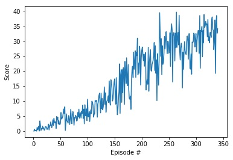

# Description of the implementation

## Algorithm
Deep Deterministic Policy Gradients (DDPG) was implemented to solve this environment, as it is particularly suitable for continous action spaces like in the example of the reacher

## Neural networks
The DDPG algorithm consists on two separated neural networks :

- One network called the "Actor", predicts the next action for the agent (in a deterministic way) from a given state
- One network called the "Critic", evaluate the Q value associated to the state and the predicted action

Each of these networks maintain a current version (that we are training using experience buffer) and a target version which are updated on a regular basis using a soft update mechanism (meaning that only a small portion of the weights from the current networks are transfer to the target network)

The Actor and the Critic neural net use the same architecture in my implementation, ie using two hidden layer of 256 and 128 neurons , batch normalization on the first hidden layer, and Relu for the activation function

## Agent setup
The agent is setup to learn from an experience buffer, meaning that we are collecting a given amount of experiences tuples (state", "action", "reward", "next_state", "done") before using mini-batches randomly selected from this experience buffer in order to train the current version of the neural networks.
To avoid stationary learning, we are using random noise (Ornstein-Uhlenbeck process), so that we keep on exploring new possibilities

## hyperparameters

The following hyperparameters led to the solving of the environment in 240 episodes

- BUFFER_SIZE = int(1e5)  # replay buffer size
- BATCH_SIZE = 128        # minibatch size
- GAMMA = 0.99             # discount factor
- TAU = 1e-3              # for soft update of target parameters
- LR_ACTOR = 1e-4        # learning rate of the actor 
- LR_CRITIC = 1e-4        # learning rate of the critic
- WEIGHT_DECAY = 0       # L2 weight decay

On top of these general hyperparameters the following two additional hyperparameters were instrumental to the quick convergence of the model :

- in OUNoise class, decrease the parameter sigma to 0.1 (instead of 0.2)
- in the step() method of the Agent , the agent was modified in such a way that it is learning 10 times in a row (from random subset of the replay buffer) , and this each 10 steps (this led to drastically boosting the learning of the neural network)

## Graph

